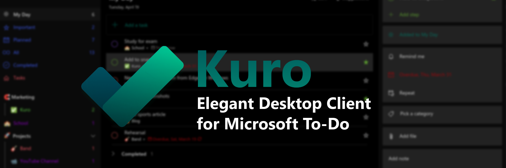

[](https://vshymanskyy.github.io/StandWithUkraine)



****
## Description

Kuro is an unofficial, featureful, open source, community-driven, free Microsoft To-Do app for Linux, made by [David Morais](https://dsmorais.com)

Kuro is a fork of [Ao](https://github.com/klaussinani/ao) which is no longer actively maintained

## Main Features
- Complete UI overhaul with 4 extra themes (**Dark, Black, Dracula and Sepia**).
  - More themes/customization to come in the future
- List colors according to your list theme
- Global shortcuts
- The perfect replacement for a Microsoft To-Do desktop client
- More to come 🔜


🆕 **Dracula Theme** 🧛


## Installation


[](https://snapcraft.io/kuro-desktop)

Head over to the [releases 🚀](https://github.com/davidsmorais/kuro/releases) page and download your distribution's package.
Checkout our [Installation Guide](https://github.com/davidsmorais/kuro/wiki/Installing-Kuro) for more information
### Snapcraft

Kuro can be found on the [Snap Store](https://snapcraft.io/kuro-desktop/).
If you have Snap installed on your system you can install Kuro by running
```
sudo snap install kuro-desktop --edge
```
### AUR

Kuro can be found in [AUR](https://aur.archlinux.org/packages/kuro-appimage) (Thanks to [Reverier-Xu](https://github.com/Reverier-Xu)).
To install Kuro, you can run

```
paru -S kuro-appimage
```

or 

```
yay -S kuro-appimage
```

### Flatpak 🔜 
_Soon Kuro will support the flatpak format_

* **Do not request new package types**. You can submit the PR or an [issue](https://github.com/davidsmorais/kuro/issues/new/choose) to have them built.


## Bug 🐞, Questions ❓ or  Feature Request 🚀 ?
Submit an [issue](https://github.com/davidsmorais/kuro/issues/new/choose) or a PR.


## Keyboard Shortcuts
Checkout the [Wiki](https://github.com/davidsmorais/kuro/wiki/Keyboard-Shortcuts) page for all keyboard shortcuts

## [Devlog](./docs/devlog.md)

### Latest Update 21/03/2022
I think most theme issues are closed and have just released a version which also fixes the auto updater. Please download 8.0.4a.

I'm thinking  about adding new themes to make Kuro even more customizable.
I'm thinking about removing the "Sepia" theme, but would like to have some insights on its usage before doing so.
Please provide feedback on the [issues](https://github.com/davidsmorais/kuro/issues) page 🚀

_________________________________________________________

## Documentation
Check out our [Wiki](https://github.com/davidsmorais/kuro/wiki) for documentation

## To-Do List
- [X] Full rebranding of Ao into Kuro
- [x] Cleaning all the bugs. These can be found in the [issues](https://github.com/davidsmorais/kuro/issues) page 🚀
- [ ] Implementing CI/CD for Linux packages 🚀
- [X] Revision of documentation
  - [ ] Landing Page with Documentation
- [ ] Multi account support
  - I'm seeing multiple To-Do tabs, but am open to feedback
- [ ] New feature discovery 🛑
  - Custom themes
  - Change branding color
